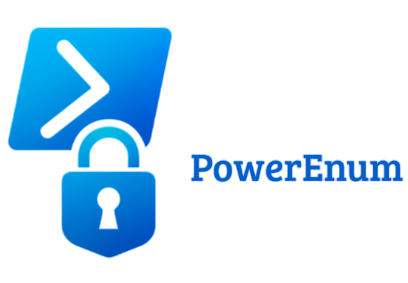

# PowerEnum - Windows Privilege Escalation Enumeration Script

## 🛡️ Introduction

**PowerEnum** is a PowerShell script that helps you quickly spot possible ways to escalate privileges on a Windows machine. It's inspired by tools like PEASS-ng and guides like HackTricks. The goal is to find common misconfigurations, weak permissions, and sensitive data that could be exploited.

Use it only for learning or on systems you’re allowed to test.
flaws, and potentially sensitive data across a Windows host.

⚠️ It is intended for **educational and authorized penetration testing purposes only**.

## [Content Index]

- [Installation](#installation)
- [Usage](#usage)
- [How It Works](#how-it-works)
- [Dependencies](#dependencies)
- [Examples](#some-examples)
- [Troubleshooting](#troubleshooting)
- [Contributors](#contributors)
- [License](#license)

## ✨ Features

- Scans for misconfigurations that could let someone escalate privileges
- Searches for credentials and secrets buried in files
- Lets you filter by file type
- Uses colors to make results easier to read
- Built to be modular, so you can add your own stuff

## Installation

No installation is required. Simply download and run the script on a PowerShell-compatible Windows system.

```powershell
powershell "IEX(New-Object Net.WebClient).downloadString('https://raw.githubusercontent.com/Jsmoreira02/Windows-Hacking/refs/heads/main/PowerEnum/PrivEscalation.ps1')"
```

> 🚀 Ensure you run PowerShell with appropriate permissions.

## Usage

```powershell
# Run a basic scan
.\PrivEscalation.ps1

# Look for saved passwords or usernames
.\PrivEscalation.ps1 -LookForCredentials

# Search specific file types
.\PrivEscalation.ps1 -LookForCredentials -Extensions ".txt,.xml"

# Just search for certain file extensions
.\PrivEscalation.ps1 -Searchfiles -Extensions ".docx,.ini"

# Need help?
.\PrivEscalation.ps1 -h/-help
```

## How It Works

🔍 The script checks a few common ways attackers try to escalate privileges:

### 🔹 Filesystem and Drive Scanning

- Checking Files and Drives
- Looks for files that might have passwords or secrets using keywords.
- Scans for extensions like `.txt`, `.xml`, `.config`
- Tries to spot things like:
  - `password`, `secret`, `token`, `api_key`, `username`
  - Regex-based matching to identify hardcoded credentials and tokens.

### 🔹 Registry and Service Misconfigurations

- Detects possible misconfigurations that may be exploited by attackers, such as:
  - Weak registry permissions
  - Services with unquoted paths
  - Auto-run registry keys

### 🔹 Local User and Group Enumeration

- Checks current user privileges
- Looks for users in admin groups they probably shouldn’t be in

### 🔹 Script Injection and Auto-Elevated Binaries

- Highlights potentially injectable paths
- Looks for binaries or scripts run by higher-privilege users

## Dependencies

- PowerShell 5.0+ recommended
- Administrator privileges enhance discovery but are not required for basic enumeration

## Some Examples

```powershell
# Search for credentials in .ini and .conf files
.\PrivEscalation.ps1 -LookForCredentials -Extensions ".ini,.conf"
```

```powershell
# Just search for all .txt and .docx files
.\PrivEscalation.ps1 -Searchfiles -Extensions ".txt,.docx"
```

## Troubleshooting

  - **False Positives:** The script looks for patterns, so some results might need a second look.
  - **Permission Problems:** Some files or areas might need admin rights to access.
  - **Script Not Running?:** You might need to change the PowerShell execution policy:

```powershell
Set-ExecutionPolicy RemoteSigned
```
or

```powershell
Set-ExecutionPolicy Unrestricted
```

## Contributors

 🤝  This tool was made by someone passionate about cybersecurity, to help others learn how to do Windows enumeration and ethical hacking.

Credits and thanks to:
- [PEASS-ng](https://github.com/peass-ng)
- [HackTricks](https://book.hacktricks.wiki)

## License

This is made for **educational and authorized security assessment purposes only**. Misuse of this script is strictly discouraged. This entire repo is for learning and legal security testing only. Don’t use it for anything shady.
