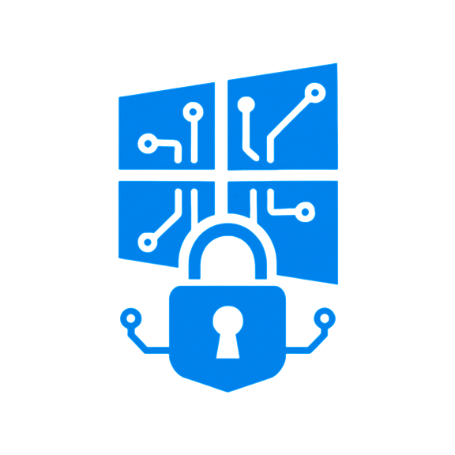

    
    
    
    
    
    

 

# Windows Hacking (Privilege Escalation Techniques)

- My study of privilege escalation on Windows systems and other techniques I've learned along the way inspired this work.

This repository serves as a database for my studies and scripts related to the Windows environment in offensive cybersecurity. Over time, I may be interested in adding Blue Team content.
Please feel free to use any useful content, including the scripts, which can be modified to suit your needs.

I am a cybersecurity student sharing this project in case it is useful to other students or professionals.

## Contents:

#### (🕓 Coming Soon) - Detailed manual of verification/vulnerability processes and how to find privilege escalation points on windows systems
#### (🕓 Coming Soon) - My Recommendation of vulnerable machines for training and access links to .OVA/.ISO
#### (🕓 Coming Soon) - Writeups (As I solve and accumulate the CTFs of windows machines)

## Working on:

- ✏️ Writing and assembling the article on my studies of privilege escalation in windows systems, which will be the next item on the list of contents in this repository
- ✏️ Playing CTFs involving Windows machines and gathering relevant information to be presented here in Writeups format

##

> ⚠️ **Disclaimer**
>
> This repository contains educational content and tools created solely for authorized and legal use.  
> All scripts and information are intended for **educational and ethical cybersecurity research purposes only**.  
> The author (me) does **not** condone or support any illegal activity and assumes **no responsibility** for the misuse of this content.
>
> It primarily serves as a proof of concept and is intended to raise awareness about cybersecurity.

***Have a good learning/Hacking! :)***
